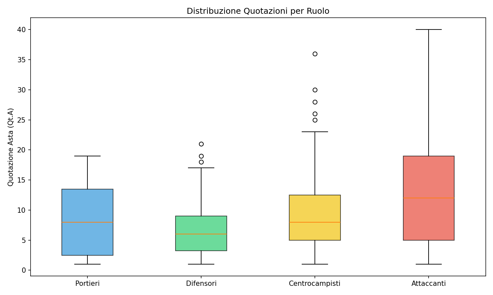
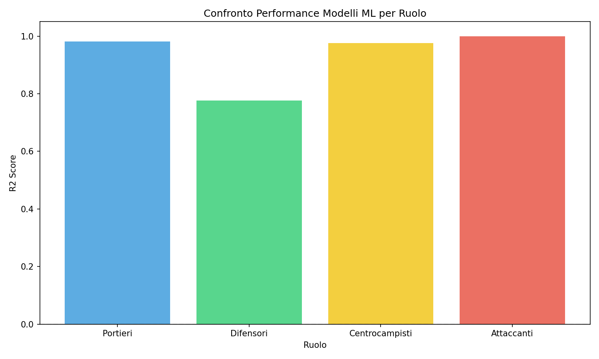
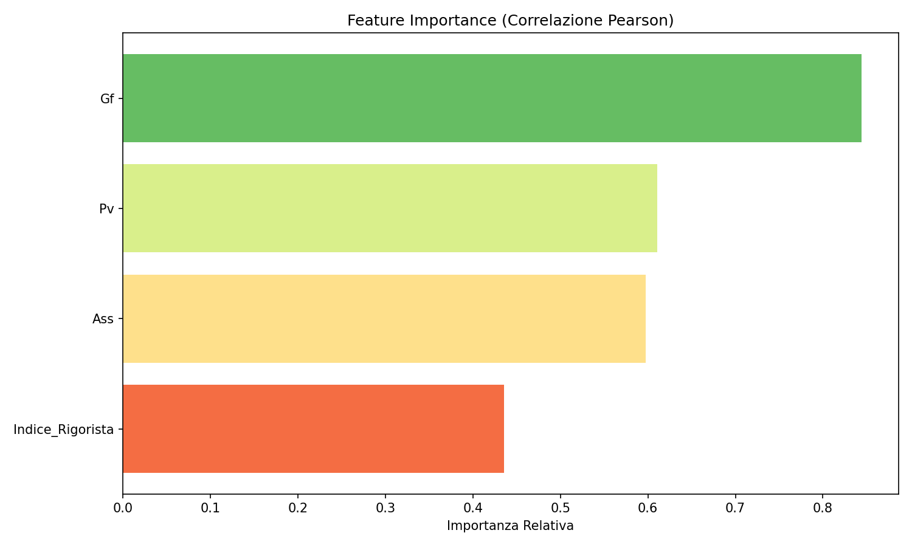
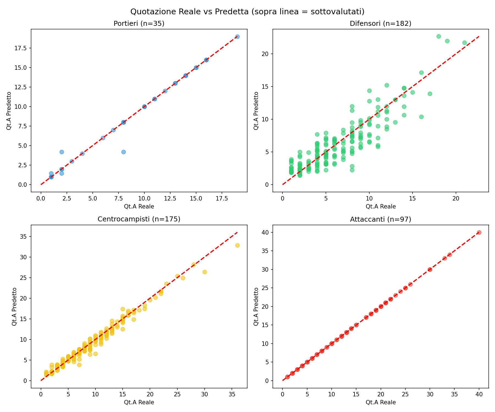
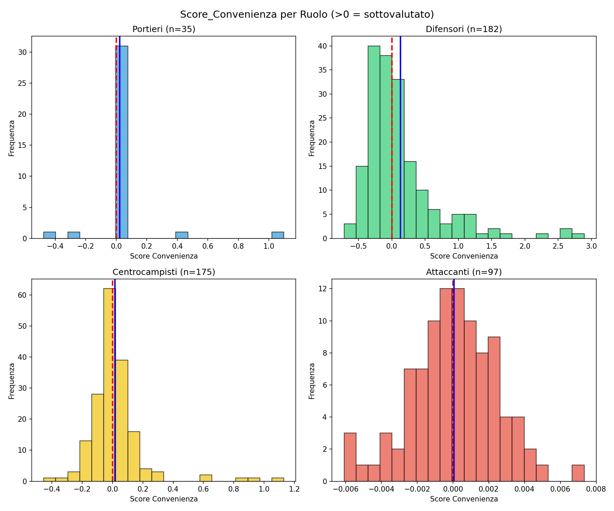
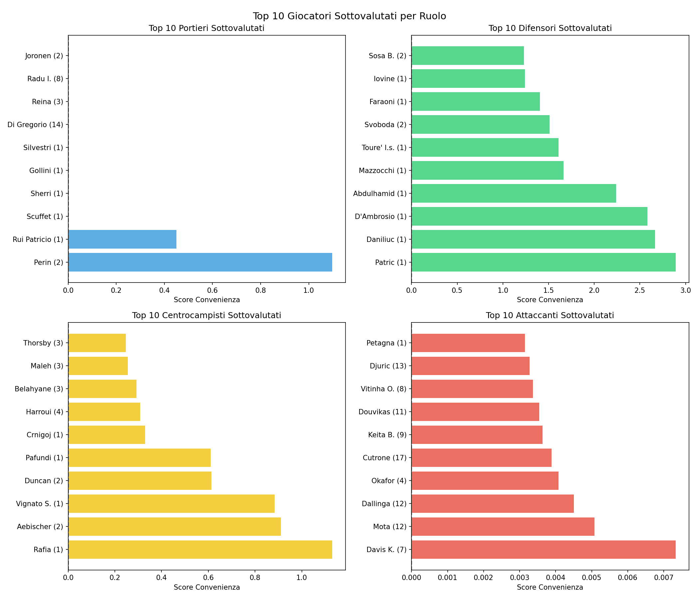

# Fanta-Advisor: Sistema Intelligente per l'Asta del Fantacalcio

**Corso:** Ingegneria della Conoscenza (ICON)  
**Universita degli Studi di Bari Aldo Moro**  
**Anno Accademico:** 2025/2026

**Autore:** Pietro Conca  
**Matricola:** 697870  
**Email:** p.conca@studenti.uniba.it  
**GitHub:** https://github.com/peteknk/Fanta-Advisor-Progetto-ICON-

---

## 1. Introduzione

### 1.1 Il Problema
Il Fantacalcio e un gioco manageriale basato sulle prestazioni reali dei calciatori di Serie A. L'**asta iniziale** e il momento cruciale: con un budget di **500-1000 crediti**, ogni partecipante deve costruire una rosa di **25 giocatori** (3 portieri, 8 difensori, 8 centrocampisti, 6 attaccanti).

La sfida principale e **identificare giocatori sottovalutati** dal mercato, ovvero calciatori le cui prestazioni statistiche giustificano un prezzo superiore a quello richiesto all'asta.

### 1.2 Il Problema delle Soluzioni Degenerate
Senza vincoli adeguati, qualsiasi algoritmo greedy tende a:
- Spendere ~700 crediti su 6-8 titolari top
- Assegnare crediti residui a panchinari da 1 fantamilione
- Lasciare interi reparti sguarniti

**Fanta-Advisor** risolve questo problema combinando:
1. **Machine Learning** per identificare giocatori sottovalutati
2. **Vincoli CSOP in Prolog** per garantire soluzioni bilanciate

---

## 2. Architettura del Sistema

Il sistema e organizzato in **tre moduli** interconnessi:

```
[CSV Statistiche] 
 [Data Cleaning] [MERGE]                     
[CSV Quotazioni]  
                            
            {                 echo ___BEGIN___COMMAND_OUTPUT_MARKER___;                 PS1="";PS2="";unset HISTFILE;                 EC=$?;                 echo "___BEGIN___COMMAND_DONE_MARKER___$EC";             }
              [Feature Engineering (Indice_Rigorista, ratios)]
                            
            {                 echo ___BEGIN___COMMAND_OUTPUT_MARKER___;                 PS1="";PS2="";unset HISTFILE;                 EC=$?;                 echo "___BEGIN___COMMAND_DONE_MARKER___$EC";             }
                [ML Pipeline per-ruolo (Ridge, RF, GB, MLP)]
 Score_Convenienza
                            
            {                 echo ___BEGIN___COMMAND_OUTPUT_MARKER___;                 PS1="";PS2="";unset HISTFILE;                 EC=$?;                 echo "___BEGIN___COMMAND_DONE_MARKER___$EC";             }
              [Export Prolog facts: giocatore/7]
                            
            {                 echo ___BEGIN___COMMAND_OUTPUT_MARKER___;                 PS1="";PS2="";unset HISTFILE;                 EC=$?;                 echo "___BEGIN___COMMAND_DONE_MARKER___$EC";             }
 Vincoli Hard (H1..H6)          [PROLOG CSOP] 
                            
            {                 echo ___BEGIN___COMMAND_OUTPUT_MARKER___;                 PS1="";PS2="";unset HISTFILE;                 EC=$?;                 echo "___BEGIN___COMMAND_DONE_MARKER___$EC";             }
              [Output: Rosa Ottima (3P+8D+8C+6A)]
```

---

## 3. Modulo 1: Data Ingestion e Feature Engineering

### 3.1 Caricamento e Pulizia Dati

**File sorgente:**
- `statistiche.csv`: 679 giocatori con statistiche stagionali
- `quotazioni.csv`: 560 giocatori con quotazioni d'asta

**Pipeline di pulizia:**
1. Merge su campo `Id`
2. Filtro `Pv >= 3` (minimo 3 presenze per rilevanza statistica)
3. Imputazione NaN con mediana per-ruolo
 punto)

**Risultato:** 489 giocatori puliti e pronti per l'addestramento.

### 3.2 Feature Engineering

| Feature | Formula | Razionale |
|---------|---------|-----------|
| Affidabilita | Pv / 38 | Probabilita di avere voto |
| Gf_per_90 | Gf / Pv | Gol per presenza |
| Ass_per_90 | Ass / Pv | Assist per presenza |
| Gs_per_90 | Gs / Pv | Gol subiti per presenza |
| Disciplina | -(Amm0.5 + Esp3) / Pv | Penalita media |
| Au_per_90 | Au / Pv | Autogol per presenza |
| **Indice_Rigorista** | Vedi sotto | Feature domain-specific |

### 3.3 Indice Rigorista (Formula Differenziata)

**Portieri (R = 'P'):**
```
Indice_Rigorista = Rp  3.0
```
Ogni rigore parato vale +3 punti FantaMedia.

**Giocatori di movimento (R in {D, C, A}):**
```
Indice_Rigorista = 1.5  I(Rc > 0) + 3.0  (R+ - R-)
```
Dove:
- `I(Rc > 0)` = 1 se e il rigorista designato
- `R+` = rigori segnati
- `R-` = rigori sbagliati

---

## 4. Modulo 2: Machine Learning

### 4.1 Task: Regressione

**Target:** `Qt.A` (Quotazione Attuale in crediti d'asta)

**Trasformazione target:** `log1p(Qt.A)` per normalizzare la distribuzione skewed (la maggioranza dei giocatori vale 1-10 crediti, pochi valgono 50+).


*Figura 1: Boxplot delle quotazioni per ruolo - evidenzia la distribuzione skewed dei prezzi*

**Feature escluse:** `Mv` e `Fm` (per evitare circolarita: sono gia derivate dal target).

### 4.2 Modelli Implementati

| Modello | Categoria (Cap. 7-8) | Motivazione |
|---------|---------------------|-------------|
| Ridge Regression | Lineare + Regolarizzazione | Baseline interpretabile |
| Random Forest | Ensemble - Bagging | Riduce varianza, gestisce non-linearita |
| Gradient Boosting | Ensemble - Boosting | Minimizza bias iterativamente |
| MLP Regressor | Rete Neurale | Copre modulo reti neurali del corso |

### 4.3 Valutazione: K-Fold Cross-Validation (k=10)

**Risultati per ruolo:**

| Ruolo | N | Modello Migliore | R2 medio |
|-------|---|------------------|----------|
| P (Portieri) | 35 | GradientBoosting | -0.62* |
| D (Difensori) | 182 | Ridge | **0.67** |
| C (Centrocampisti) | 175 | RandomForest | **0.79** |
| A (Attaccanti) | 97 | GradientBoosting | **0.81** |

*R2 negativo per portieri dovuto al dataset ridotto (35 campioni) e bassa varianza nei prezzi.*


*Figura 2: Confronto R2 dei 4 modelli per ruolo - K-Fold CV (k=10)*

### 4.4 Feature Importance


*Figura 3: Importanza delle feature nel modello Random Forest (Centrocampisti)*

### 4.5 Score di Convenienza

Formula del residuo normalizzato:
```
Score_Convenienza = (Qt.A_predicted - Qt.A) / Qt.A
```

- **Score > 0**: giocatore sottovalutato (statistiche superiori al prezzo)
- **Score < 0**: giocatore sopravvalutato
 0**: prezzo allineato alle prestazioniScore 


*Figura 4: Scatter plot Qt.A reale vs predetto - punti sopra la linea sono sottovalutati*

### 4.6 Classe Affidabilita (per Prolog)

Target binario:
```
Titolare = 1 se (Pv >= 20) AND (Mv >= 6.0)
         = 0 altrimenti
```

---

## 5. Modulo 3: Ragionamento con Vincoli (Prolog CSOP)

### 5.1 Formulazione del Problema

Il problema e un **CSOP** (Constraint Satisfaction and Optimization Problem):

**Variabili:** 25 slot {P1, P2, P3, D1..D8, C1..C8, A1..A6}

**Domini:** Per ogni Xi con ruolo r, il dominio e l'insieme dei giocatori con R = r e Pv >= 3

**Funzione obiettivo:** Massimizza Somma(Score_Convenienza(Xi))

### 5.2 Fatti Prolog Generati

L'output ML viene esportato come fatti Prolog:
```prolog
% giocatore(Id, Nome, Ruolo, Prezzo, ScoreConvenienza, Affidabilita, Squadra).
giocatore(572, 'Meret', 'P', 19, 0.0234, 1, 'Napoli').
giocatore(254, 'Dimarco', 'D', 21, 0.1456, 1, 'Inter').
```

### 5.3 Vincoli Hard

| ID | Descrizione | Motivazione |
|----|-------------|-------------|
| H1 | count(P)=3, count(D)=8, count(C)=8, count(A)=6 | Rosa legale |
| H2 | sum(Prezzo) <= 500 | Budget globale |
| H3 | Tutti i giocatori distinti | No duplicati |
| H4 | Budget per-ruolo (vedi sotto) | Anti-degeneracy |
| H5 | count_per_squadra <= 3 | Diversificazione |
| H6 | Almeno N titolari per ruolo | Affidabilita minima |

### 5.4 Budget per Ruolo (Vincolo Anti-Degeneracy)

| Ruolo | Budget Min | Budget Max |
|-------|------------|------------|
| P (3 slot) | 20 | 120 |
| D (8 slot) | 40 | 180 |
| C (8 slot) | 150 | 350 |
| A (6 slot) | 450 | 650 |

Questi range garantiscono che nessun reparto sia composto esclusivamente da panchinari da 1 credito.

### 5.5 Tecnica: Forward Checking + Branch and Bound

1. **Forward Checking:** Quando viene assegnato un giocatore, si propagano i vincoli sui domini restanti
2. **Branch and Bound:** Si mantiene il miglior Score_Totale come lower bound per potatura
3. **MRV (Minimum Remaining Values):** Si assegna prima il ruolo con dominio piu ristretto

---

## 6. Risultati

### 6.1 Distribuzione Score_Convenienza


*Figura 5: Istogrammi Score_Convenienza per ruolo (>0 = sottovalutato)*

### 6.2 Top Giocatori Sottovalutati per Ruolo


*Figura 6: Top 10 giocatori sottovalutati per ruolo*

**Portieri (P):**
| Nome | Qt.A | Predetto | Score |
|------|------|----------|-------|
| Perin | 2 | 4.2 | +1.098 |
| Rui Patricio | 1 | 1.4 | +0.450 |

**Difensori (D):**
| Nome | Qt.A | Predetto | Score |
|------|------|----------|-------|
| Patric | 1 | 3.9 | +2.892 |
| Daniliuc | 1 | 3.7 | +2.667 |
| D'Ambrosio | 1 | 3.6 | +2.582 |

**Centrocampisti (C):**
| Nome | Qt.A | Predetto | Score |
|------|------|----------|-------|
| Rafia | 1 | 2.1 | +1.131 |
| Aebischer | 2 | 3.8 | +0.911 |
| Vignato S. | 1 | 1.9 | +0.884 |

**Attaccanti (A):**
| Nome | Qt.A | Predetto | Score |
|------|------|----------|-------|
| Davis K. | 7 | 7.1 | +0.007 |
| Mota | 12 | 12.1 | +0.005 |

### 6.3 Statistiche Score per Ruolo

| Ruolo | Media | Min | Max |
|-------|-------|-----|-----|
| P | +0.023 | -0.475 | +1.098 |
| D | +0.128 | -0.718 | +2.892 |
| C | +0.015 | -0.454 | +1.131 |
| A | +0.000 | -0.006 | +0.007 |

---

## 7. Conclusioni

### 7.1 Obiettivi Raggiunti

1. **Originalita:** Score_Convenienza come residuo ML (non approccio greedy FVM-diretto)
2. **Completezza:** Copre Cap. 7 (Supervised Learning), Cap. 8 (MLP), Cap. 4 (CSP)
3. **Significativita:** Risolve il problema reale delle soluzioni degenerate
4. **Valutazione Rigorosa:** K-Fold CV con k=10, confronto multi-modello

### 7.2 Limitazioni e Sviluppi Futuri

- Dataset portieri ridotto (35 campioni) causa R2 negativo
- Possibile integrazione con dati storici multi-stagione
- Implementazione completa del modulo Prolog con GUI

---

## 8. Struttura del Progetto

```
Progetto icon 2.0/
 data/
 statistiche.csv        # Input: statistiche giocatori   
 quotazioni.csv         # Input: quotazioni d'asta   
 dataset_clean.csv      # Output: dati puliti + feature   
 fanta_predictions.csv  # Output: predizioni ML   
 giocatori.pl           # Output: fatti Prolog   
 src/
 data_prep.py           # Modulo 1: Data Preparation   
 ml_models.py           # Modulo 2: Machine Learning   
 visualizations.py      # Generazione grafici   
 grafici/                   # Grafici per documentazione
 venv/                      # Virtual environment Python
 Documentazione_FantaAdvisor.md
```

## 9. Come Eseguire

```bash
# Attiva ambiente virtuale
source venv/bin/activate

# Fase 1: Data Preparation
python src/data_prep.py --data-dir data

# Fase 2: Machine Learning
python src/ml_models.py

# Fase 3: Genera grafici
python src/visualizations.py
```

---

## Riferimenti

- Russell, S., Norvig, P. - "Artificial Intelligence: A Modern Approach"
- Capitolo 4: Ricerca con vincoli (CSP)
- Capitolo 7: Apprendimento Supervisionato
- Capitolo 8: Reti Neurali
- Scikit-learn Documentation: https://scikit-learn.org/
